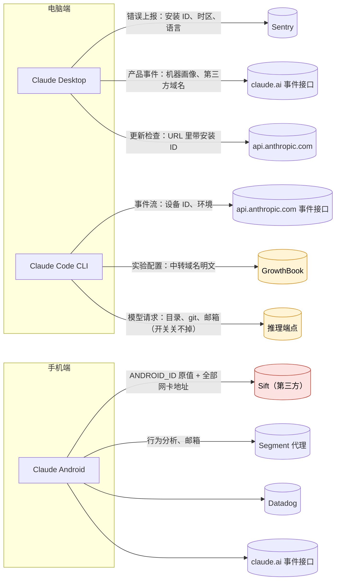
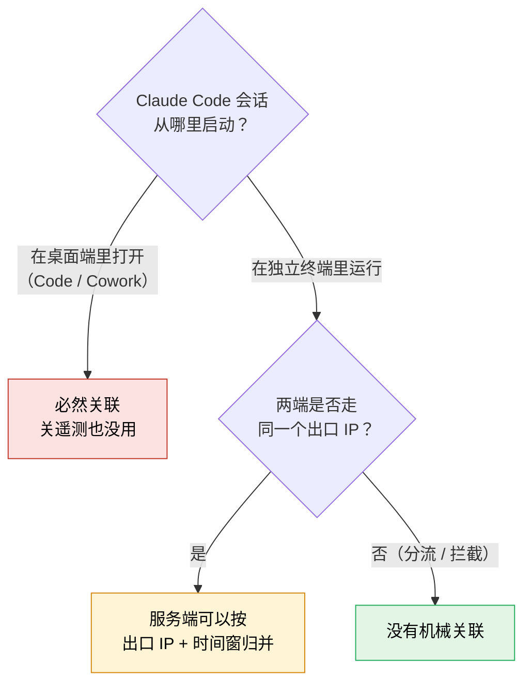

# Claude 三端遥测与隐私审计：Desktop · Claude Code · Android

我们对 Anthropic 的三个官方客户端做了源码级逆向，想回答三个问题：**它在后台发了什么、这对你意味着什么、你怎么关掉它。**

| 审计对象 | 版本 | 素材 |
|---|---|---|
| Claude Desktop（macOS） | 2.9939.2 | `app.asar` 解包后的主进程与渲染进程代码、10 个原生模块 |
| Claude Code CLI（darwin-arm64） | 2.1.283 | 从 bun 单文件二进制中切出的 2153 个明文模块 |
| Claude Android | 1.260930.20 | Google Play 分发的 base APK 反编译，另做了真机与模拟器抓包 |

> [!NOTE]
> 结论只对上表这几个版本成立。桌面端与 CLI 的素材都来自 macOS 构建，代码里虽然能看到 Windows / Linux 分支，但那些平台上的安装路径和卸载行为本仓库没法证实。本页只讲结论，**证据在 [`telemetry/`](telemetry/) 下的主题文档里**，每条结论都附有可以照着跑的检索命令（见 [§7](#7-证据与复验)）。

---

## 1. 先说三件最要紧的事

### ① 手机端会上报你重置不了的系统级设备 ID

电脑端两个产品都不读硬件码，Android 端读。它把系统的 `ANDROID_ID` **原值**交给第三方反欺诈服务 Sift：不哈希，不加盐。这个值换账号不变，卸载重装也不变，系统设置里没有重置入口。App 每创建一个界面就采集一次，**登录之前就开始**。同时它会枚举手机的全部网卡地址，其中的公网 IPv6 **开着 VPN 也照样报上去**，可以据此反查运营商和大致省份。三端里只有这一条是你在应用里怎么设置都躲不开的。

### ② 电脑端不抓硬件码，但常见的三种自保办法都有漏洞

- **关遥测关不掉模型请求。** CLI 每次对话都会带上设备标识、账号和会话 ID。自动模式下工作目录和家目录以原文路径上传，系统提示词里还有 git 提交者、近期提交标题和账号邮箱。这些属于模型请求本身，不算遥测，所以哪个遥测开关都不管它们。
- **改时区作用有限。** 事件时间戳一律是 UTC。真正暴露时区的是桌面端的错误上报和 CLI 提示词里注入的本地时区。
- **用第三方 API Key 不等于隐身。** 桌面端和 CLI 都会**明文**上报你配置的中转域名，而且桌面端不登录也照报。

好消息是：电脑端的设备标识都是软件随机生成的，删掉对应文件就能重置。但「随机标识 + 明文环境信息 + 不受开关约束的请求体」合在一起，仍然足以长期刻画一台机器。

### ③ 桌面端和 CLI 会不会被认成同一台机器，要分情况，多数情况下不会

只有**在桌面端里面启动 Claude Code / Cowork 会话**时两边才必然关联，而且关遥测也没用。CLI 单独在终端里跑时，代码层面没有任何桥。唯一能机械关联的是**同一个出口 IP 加上时间窗**，这一条靠代理分流就能切断（见 [§4](#4-桌面端与-cli-会被关联吗)）。

---

## 目录

- [1. 先说三件最要紧的事](#1-先说三件最要紧的事)
- [2. 电脑端：Claude Desktop 与 Claude Code](#2-电脑端claude-desktop-与-claude-code)
- [3. 手机端：Claude Android](#3-手机端claude-android)
- [4. 桌面端与 CLI 会被关联吗](#4-桌面端与-cli-会被关联吗)
- [5. 加固与隔离](#5-加固与隔离)
- [6. 标识符速查](#6-标识符速查)
- [7. 证据与复验](#7-证据与复验)
- [8. 其他](#8-其他)

**全景：三个客户端各自把什么发去了哪里**



---

## 2. 电脑端：Claude Desktop 与 Claude Code

### 2.1 桌面端在后台发了什么

桌面端有四条彼此独立的通道，各有各的开关。它**不区分**「官方账号」和「第三方 provider」，所以换成第三方 Key 并不会让任何一条通道停下。

| 通道 | 发往 | 什么时候发 | 带了什么 | 受遥测开关约束吗 |
|---|---|---|---|---|
| 错误上报 | Sentry（`o1158394.ingest.us.sentry.io`，硬编码） | 启动即发，**不需要登录** | 安装 ID `ant-did`、系统时区与语言（如 `Asia/Shanghai`、`zh-CN`）、内核版本、内存、屏幕分辨率 | 是（`disableEssentialTelemetry`） |
| 产品事件 | `claude.ai/api/event_logging/v2/batch` | 启动即排队，满 50 条或约每分钟发一批 | 722 种事件；每条都带 CPU 型号、总内存、系统版本与 build 号、安装 ID，还有**明文的推理端点域名** | 是（`disableNonessentialTelemetry`） |
| 更新检查 | `api.anthropic.com/api/desktop/…/update` | 启动时一次，之后约每小时一次 | **安装 ID 明文拼在 URL 里**，外加版本号和系统版本 | **否**，只能单独关闭自动更新 |
| 企业 OTLP 导出 | 管理员配置的 collector | 默认关，不配端点就不启动 | 事件名与脱敏后的属性，外加系统登录用户名和企业身份 | 否，由管理员配置决定 |

另外几点：

- **不读硬件码。** 整个桌面端代码里没有 `IOPlatformUUID`、`machineId`、`ioreg` 之类的读取。机器侧唯一的持久标识是 `ant-did`，它是首次需要时生成的随机 UUID。
- **遥测不报主机名。** Sentry 显式关掉了 `serverName`，产品事件里也没有主机名字段。主机名只在两处离开本机：远程工具桥连接时发的 `device_name`，以及 Cowork 远程设备注册时的显示名。
- **系统代理：主进程和遥测路径不读，但原生模块读。** macOS 原生扩展会读系统代理设置，用来配置 Cowork 虚拟机的网络，这个值不上报。VPN / 虚拟网卡探测只在一种情况下运行：Cowork 虚拟机启动失败。探到的网卡名经哈希后上报。
- **有两样东西不受 `disableNonessentialTelemetry` 约束：**删除 Cowork 会话时发出的那条事件，以及更新检查。
- **在桌面端里打开 Claude Code 会话时**，`desktop_ccd_*` 事件会带上 CLI 会话 ID、CLI 版本、模型名和 token 计数，与安装 ID、账号放在同一条记录里（见 [§4](#4-桌面端与-cli-会被关联吗)）。
- **崩溃转储按原始字节上传**，脱敏钩子管不到这部分，是桌面端脱敏最薄弱的地方。

> [!WARNING]
> **不登录也会发。**一个从没登录过、只填了第三方 Key 的桌面端，启动后就有三条带安装 ID 的请求出站（错误上报、产品事件、更新检查）。服务端由此能看到：这台机器在用哪个第三方端点、它的时区和语言、机型级指纹。整个过程不需要登录。

详见 [`telemetry/desktop.md`](telemetry/desktop.md) §1–§2，未登录场景的逐条请求见 [`telemetry/linked.md`](telemetry/linked.md) §1。

### 2.2 命令行端在后台发了什么

CLI 的上报行为由一个判断决定：**它把你算不算「第一方」用户。**这个判断只看两样东西：`CLAUDE_CODE_USE_*` 系列环境变量，以及凭据类型。它**不看 `ANTHROPIC_BASE_URL`**。

| 你的配置 | CLI 的判定 | 结果 |
|---|---|---|
| 官方账号 / 官方 API Key | 第一方 | 遥测全开 |
| **只把 `ANTHROPIC_BASE_URL` 指向自建中转** | **仍是第一方** | **遥测全开，中转域名还会被明文上报** |
| 设了 `CLAUDE_CODE_USE_BEDROCK` / `_VERTEX` / `_FOUNDRY` 等 | 第三方 | 事件流、实验配置、内部指标、Datadog 一并关闭 |
| 带网关凭据 | 网关 | 同上，一并关闭 |

> [!IMPORTANT]
> **很多人以为「API 地址指向自己的中转 = 不给 Anthropic 发数据」，这是错的。**CLI 每隔几小时会向 `api.anthropic.com` 拉一次实验配置（GrowthBook），请求体里有一个字段叫 `apiBaseUrlHost`，值就是你中转的域名，**明文**，同时还带着设备 ID、会话 ID，以及登录后的账号和组织 ID。自定义 `ANTHROPIC_BASE_URL` 实际只关掉一条默认就关着的 Datadog 错误追踪，其余通道照常运行。

**CLI 的全部通道**

| 通道 | 发往 | 默认 | 说明 |
|---|---|---|---|
| 事件流（`tengu_*`） | `api.anthropic.com/api/event_logging/v2/batch` | **开** | 未登录也发，每条都带设备 ID |
| 实验配置（GrowthBook） | `api.anthropic.com/api/eval/…` | **开** | 带 `apiBaseUrlHost`，约每 6 小时刷新一次 |
| 内部指标 | `api.anthropic.com/api/claude_code/metrics` | 条件开 | 只对 API Key 用户与 Team / Enterprise 订阅生效，个人 Pro / Max 不发 |
| Datadog 日志 / 错误追踪 | `http-intake.logs.us5.datadoghq.com`、`browser-intake-us5-datadoghq.com` | 关 | 由远端开关控制，代码里的默认值是关 |
| 用户自配 OTel | 你自己设的 `OTEL_EXPORTER_OTLP_*` | 关 | 需要 `CLAUDE_CODE_ENABLE_TELEMETRY=1` 才启用 |
| Beta tracing / 会话中继 | 指定端点 | 关 | 需要专门的环境变量 |
| Sentry、Statsig | — | **不存在** | 代码里没有 DSN、没有 SDK，也没有出口 |

**几个值得知道的细节**

- **CLI 也不读硬件码，而且是有意不读。**它其实在 OTel 初始化时读过一次真实硬件码（macOS 的 `IOPlatformUUID`、Linux 的 `/etc/machine-id`），但合并资源属性时只留下了 CPU 架构，硬件码被直接丢弃。`~/.claude.json` 里的 `userID` 和 `machineID` 都是随机生成的 64 位十六进制串，删掉就会重新生成。
- **网关痕迹会回传。**API 出错时，CLI 会把响应头里的网关特征原样上报（`via`、`x-cache`、`x-zscaler-*`、`x-apigee-*` 等前缀），还会报告你是否设置了代理环境变量。走自建中转时，这一项最容易被忽略。
- **「哈希脱敏」并不可靠。**插件名一类的哈希字段要么不加盐，要么用的是公开常量做盐，可以用字典反查，同名插件在不同用户之间也能对上。技能名、插件名和市场名本身就以原文上传。
- **遥测里没有时区、语言、主机名。**但时区会通过提示词进入模型请求。主机名只在两个场景的请求体里出现：受信设备注册，以及 Cowork 远程设备注册。
- **`anthropic-client-platform` 这个请求头不是默认发的**，只有由桌面端拉起的会话才带。

详见 [`telemetry/cli.md`](telemetry/cli.md)：判定机制在 §1，通道在 §2，中转域名上报在 §5.2，模型请求面在 §4.4。

### 2.3 两端共有的结论

| | 桌面端 | CLI |
|---|---|---|
| 读硬件码吗 | 不读 | 读过一次后丢弃，不上报 |
| 机器标识 | `ant-did`，随机 UUID | `userID`，随机 64 位十六进制 |
| 能重置吗 | 退出后删掉 `<userData>/ant-did` | 删掉 `~/.claude.json` 里的 `userID` |
| 会明文上报第三方域名吗 | **会**（产品事件里的 `inference_host`） | **会**（实验配置里的 `apiBaseUrlHost`） |
| 开关能关掉遥测吗 | 能（托管配置） | 能（环境变量） |
| 开关能关掉模型请求的内容吗 | — | **不能** |

关于重置：删除文件即可重置，这一点确定。**卸载重装会不会顺带清掉这个文件**，取决于安装形态和卸载器怎么实现，代码之外没法下定论。

---

## 3. 手机端：Claude Android

> [!CAUTION]
> 电脑端连读都不读的硬件级标识，手机端直接取原值交给第三方。这是三端之间最大的分野。

### 3.1 五条分析通道

| 通道 | 发往 | 带了什么 |
|---|---|---|
| **Sift 设备指纹**（第三方反欺诈） | `api3.siftscience.com` | **`ANDROID_ID` 原值**、全部网卡地址、厂商与型号、运营商名、SIM 卡国家码、电量与充电状态 |
| Segment 行为分析 | `a-api.anthropic.com`（Anthropic 自建的代理） | 行为事件、账号与组织 ID；登录时的 identify 请求带**邮箱** |
| Datadog 性能监控 | `browser-intake-us5-datadoghq.com` | RUM 会话（**采样率 100%**）、请求追踪；是否启用由服务端开关控制 |
| Sentry 崩溃上报 | `o1158394.ingest.us.sentry.io` | 错误与性能数据，`user.id` 为账号 UUID |
| 一方事件 | `claude.ai/api/event_logging/v2/batch` | 产品事件，与网页版同一套命名 |

我们在真机上做了冷启动抓包：启动后两分钟内，Segment、一方事件、Datadog、Sift 四条通道都有流量。

### 3.2 `ANDROID_ID`：为什么说「重置不了」

- 它是系统按「用户 + 应用签名」生成的值，App 每次采集都现场读取，不哈希也不截断。
- **卸载重装不变，换账号也不变。**只有这几种情况会变：恢复出厂设置、换到另一个系统用户或工作资料（Work Profile）、应用签名密钥变更、root 后改写系统设置库。
- Sift 的采集挂在「每个界面创建时」这个时机上，**冷启动、还没登录就会采**。

### 3.3 网卡地址与穿透 VPN 的公网 IPv6

App 枚举设备上的全部网络接口，**只剔除回环地址**（`127.0.0.1` / `::1`）。WiFi 和蜂窝网卡上的地址都会进入 `network_addresses` 字段：内网 IPv4，加上**真实的公网 IPv6**。

- **VPN 挡不住：**VPN 改变的是流量从哪里出去，不改变网卡表的内容。IPv6 不 nat，隧道口地址和底层网卡地址里的公网 IPv6 地址会一起出现在列表里。所以即使出口 IP 显示在海外，这个字段里仍然有你真实接入线路的 IPv6 前缀。
- **能推出什么：**运营商（高置信度）、省或大区（中等置信度），城市一级比较弱，定位不到具体某一户。国内家宽的 IPv6 前缀会随重拨轮换，并非永久不变。
- 隐私政策用「设备与连接信息」这一类别笼统覆盖了这类数据，Sift 也在子处理者名单上，但**网卡级地址没有被逐项披露**。

### 3.4 没有给用户的开关

App 里没有任何遥测或分析开关。唯一的门控是一个组织级、由服务端决定的标志（`third_party_analytics_disabled_for_org`），默认不禁用。所以普通用户想挡住这些数据，**只能在网络层拦截**（见 [§5.1](#51-手机端)）。

<details>
<summary>顺带发现：Sift 的 root 检测在正式版上完全失效</summary>

Sift 那套 root / 篡改取证有四路探测，结果字段在任何正式版设备上都恒为空。其中两路是实现 bug：一路读的系统属性普通 App 无权读取，另一路解析 `mount` 输出时数组下标取错了。它探不到任何东西。

</details>

详见 [`telemetry/android.md`](telemetry/android.md)：通道在 §2，身份在 §4，Sift 在 §5，同意门控与披露在 §7。

---

## 4. 桌面端与 CLI 会被关联吗

很多人在一台电脑上两个都用。会不会被关联，取决于 **CLI 是从哪里启动的**。



### 场景一：在桌面端里启动会话，必然关联

在桌面端里打开 Code 或 Cowork 会话，需要先登录桌面端。这时有三条机制把两边绑在一起：

1. **一条事件同时记下三样东西。**桌面端的 `desktop_ccd_*` 事件里，安装 ID、账号和 CLI 会话 ID 出现在同一条记录中。这条记录由桌面端自己发出，**关掉 CLI 的遥测拦不住它**。
2. **同一份凭据。**桌面端把自己的 OAuth token 和账号 UUID 注入子进程的环境变量，两边用同一个账号发请求。CLI 每次模型请求都带 `metadata.user_id`，里面有设备 ID、账号和会话 ID。
3. **设备 ID 播种。**桌面端还能把 `sha256(安装 ID)` 写进该会话私有目录里的 `.claude.json`，这样 CLI 上报的设备 ID 就直接由桌面端的安装 ID 派生。是否启用由服务端开关控制，而且只写会话私有目录，不碰全局的 `~/.claude.json`。

### 场景二：桌面端未登录或用第三方 Key，CLI 在独立终端运行

场景一的三座桥在这里**都走不通**。唯一的机械关联是**出口 IP + 时间窗**：代理工具把两边的流量送到同一个出站节点时，服务端可以在日志层面把两边对上。

下面任意一条成立，这个关联就断了：

- 代理工具只开本地端口、不设系统代理。这样 CLI 走 `HTTPS_PROXY`，桌面端直连。
- 按域名分流，或者按进程分流（`Claude` 与 `node` / `bun` 走不同节点）。
- 用托管配置的 `egressProxyUrl` 把桌面端固定到另一个代理。
- 直接拦截桌面端发往 Anthropic 的流量。

**下面这些猜测经源码查证都不成立：**

| 猜测 | 实际情况 |
|---|---|
| 两边共享会话 / 消息 ID | 不共享。桌面端会扫描本地 CLI 会话文件，但只用于本地界面展示，不上传。唯一带该 ID 的事件需要登录 |
| 两边的哈希能对上 | 对不上。算法不同、加盐方向相反、截断长度不同，两边不会产生相同的字节串 |
| 共享 `~/.claude.json` 的内容会被上报 | 不会。两边都读写这个文件，但桌面端的事件载荷里不含 CLI 的 `userID` / `machineID` |
| 桌面端会上报 Cloudflare 的 `cf_ray` | 未登录时不会 |
| 请求头里有共享的键 | 没有。请求头要么只有一端发，要么两端同名但取值不同 |
| 改时区就能隔离两端 | 对 CLI 无效，CLI 的遥测里本来就没有时区。持续暴露中国环境的是桌面端的错误上报 |

另有两种**有条件**的关联，需要服务端额外计算：

- 桌面端以 hybrid 等特定形态部署，或者管理员在托管配置里填了真实的组织 UUID，就会产生组织级关联。
- 桌面端已登录，并且两端装了同名的插件或技能：服务端可以拿 CLI 上报的明文名称，重算桌面端的无盐哈希来比对。

详见 [`telemetry/linked.md`](telemetry/linked.md)。

---

## 5. 加固与隔离

### 5.1 手机端

App 内没有开关，所以办法全在网络层和系统层。

1. **拦截以下域名**（Surge / Clash / sing-box / AdGuard Home 均可）：

   | 域名 | 拦掉什么 |
   |---|---|
   | `api3.siftscience.com` | **最重要**：`ANDROID_ID`、网卡地址、设备环境 |
   | `a-api.anthropic.com`、`a-cdn.anthropic.com` | Segment 行为分析 |
   | `browser-intake-us5-datadoghq.com` | Datadog 性能监控与请求追踪 |
   | `o1158394.ingest.us.sentry.io` | 崩溃上报 |

   一方事件接口 `claude.ai/api/event_logging/` 和正常业务共用 `claude.ai` 域名，按域名拦截会连业务一起断。要单独拦它只能做路径级过滤。我们没有验证拦截 Sift 会不会影响登录或风控判定。

2. **防止公网 IPv6 暴露接入线路：**把移动数据的 APN 协议改成纯 IPv4，或者在家用路由器上关闭 IPv6 地址分配。

3. **换一个 `ANDROID_ID`：**卸载重装没用。可以在工作资料（Shelter、Island 等工具创建）、新建的系统用户或单独的设备里使用，这些环境下的 `ANDROID_ID` 都是独立的。

### 5.2 桌面端

1. **托管配置里关遥测。**配置来源有三处：macOS 读 MDM 描述文件（域为 `com.anthropic.claudefordesktop`，落在 `/Library/Managed Preferences/` 下），Windows 读组策略注册表 `HKLM\SOFTWARE\Policies\Claude`，Linux 读 `/etc/claude-desktop/managed-settings.json`。

   | 键 | 作用 |
   |---|---|
   | `disableEssentialTelemetry: true` | 关闭错误上报（Sentry） |
   | `disableNonessentialTelemetry: true` | 关闭产品事件与诊断包上传 |
   | `disableAutoUpdates: true` | 关闭更新检查。**遥测开关管不到它，必须单独设** |
   | `otlpEndpoint` | 保持为空 |

   > [!NOTE]
   > 这两个遥测键在配置定义里标注为面向「第三方部署」（也就是 BYOK 场景）。它们的默认值都是「发送」，但配置文件损坏或无法读取时会按「已关闭」处理。

2. **环境变量 `CI=1`**能让桌面端跳过错误上报的初始化，并丢弃产品事件。但 `CI` 是个通用变量，很多程序会因为它改变行为（比如关掉交互提示、换成另一种输出格式），只建议给桌面端进程单独设置，不要全局导出。终端里的 `DISABLE_TELEMETRY`、`DO_NOT_TRACK` 对桌面端**完全无效**。

3. **网络层拦截：**`*.ingest.us.sentry.io`、`claude.ai/api/event_logging/*`、`api.anthropic.com/api/desktop/*/update`，以及模型目录轮询用的 `downloads.claude.ai`。**不要整个拦掉 `api.anthropic.com`**，如果 CLI 用官方账号，会连推理一起断掉。最好按进程区分。

4. **重置安装 ID：**彻底退出桌面端，删除 `<userData>/ant-did`（macOS 默认在 `~/Library/Application Support/Claude/ant-did`），再重新打开就会生成新 ID。以前在桌面端里开过的会话，私有目录可能还留着派生 ID，需要的话一并清理。

### 5.3 CLI

```bash
# 关闭事件流、实验配置、内部指标、Datadog
export CLAUDE_CODE_DISABLE_NONESSENTIAL_TRAFFIC=1
export DISABLE_TELEMETRY=1
export DISABLE_ERROR_REPORTING=1
# 单独确保不拉实验配置（中转域名就是随它上报的）
export DISABLE_GROWTHBOOK=1
# 不在系统提示词里写入 git 用户名和近期提交
export CLAUDE_CODE_DISABLE_GIT_INSTRUCTIONS=1
```

- **不要设置** `CLAUDE_CODE_ENABLE_TELEMETRY`，也**不要开启** `OTEL_LOG_TOOL_DETAILS`。后者会把完整的命令文本和文件路径以原文上报。
- 如果你本来就在用 Bedrock / Vertex 等云服务，用对应的 `CLAUDE_CODE_USE_*` 显式声明，CLI 会自动关掉全部遥测通道。
- **模型请求里的内容没有开关**：设备 ID、会话 ID、自动模式下的工作目录都会照常发送。
- **改主机名**：别让主机名里出现真实姓名或公司名。受信设备注册和 Cowork 设备注册的请求里会带上它。
- 不想让两端关联，就**别在桌面端里启动 Claude Code**，并让两端走不同的出口（见 [§4](#4-桌面端与-cli-会被关联吗)）。

---

## 6. 标识符速查

| 标识符 | 属于 | 怎么来的 | 存在哪 | 发往哪里 | 能重置吗 | 证据 |
|---|---|---|---|---|---|---|
| `ANDROID_ID` | Android | **系统生成**，App 取原值 | 系统设置库 | Sift | **不能**（只有恢复出厂、换用户或工作资料才会变） | `android.md` §4 |
| `network_addresses` | Android | 枚举网卡，只剔除回环地址 | 不落盘，每次现读 | Sift | 随网络变化 | `android.md` §5.2.1 |
| `Anthropic-Device-ID` | Android | 随机 UUID | `device_id_prefs` | API 请求头、Segment | 清除应用数据 | `android.md` §4 |
| `ant-did` | 桌面端 | 随机 UUID | `<userData>/ant-did` | Sentry、产品事件、更新检查 URL | 删除文件 | `desktop.md` §3.1 |
| `inference_host` | 桌面端 | 你配置的推理端点域名 | 配置文件 | 产品事件（明文） | 改配置 | `desktop.md` §2.2 |
| `app_session_id` | 桌面端 | 每次启动随机生成 | 只在内存里 | 产品事件 | 每次启动都换 | `desktop.md` §2.2 |
| Secure Enclave 密钥 | 桌面端 | 在硬件里**随机生成**的 P-256 密钥对（不是读出来的硬件 ID） | 钥匙串 | 设备注册；匹配出的设备行 ID 会进入遥测 | 钥匙串里的项被删后重建 | `desktop.md` §3.4 |
| `userID` | CLI | 随机 64 位十六进制 | `~/.claude.json` | 事件流、实验配置、模型请求的 `device_id` | 删除该字段 | `cli.md` §3 |
| `machineID` | CLI | 随机 64 位十六进制 | `~/.claude.json` | 只用于 Datadog 错误追踪（默认关） | 删除该字段 | `cli.md` §3 |
| `apiBaseUrlHost` | CLI | `ANTHROPIC_BASE_URL` 的域名部分 | 环境变量 | 实验配置请求（明文） | 设 `DISABLE_GROWTHBOOK=1` | `cli.md` §5.2 |
| `account_uuid` | 三端 | 登录后由服务端下发 | 各端的本地存储 | 各端事件与 API | 换账号 | 各篇 |

---

## 7. 证据与复验

本页只讲结论，举证都在下面这几篇文档里：

| 文档 | 覆盖范围 |
|---|---|
| [`telemetry/desktop.md`](telemetry/desktop.md) | 桌面端：四条通道、标识符与设备注册、开关、桌面端如何配置 CLI 子进程、提示词 / 请求头 / 日志包中的指纹、原生模块 |
| [`telemetry/cli.md`](telemetry/cli.md) | CLI：第一方判定、通道 A–I、标识符、上行字段、第三方 provider 暴露面、开关矩阵 |
| [`telemetry/linked.md`](telemetry/linked.md) | 桌面端与 CLI 的关联：分场景判定、出口 IP 关联、已证伪的机制、切断措施 |
| [`telemetry/desktop-event-catalog.md`](telemetry/desktop-event-catalog.md) | 桌面端 722 个事件名的逐条清单（数据附录） |
| [`telemetry/android.md`](telemetry/android.md) | Android：五条通道、Sift 设备指纹、身份锚点、同意门控、披露情况、攻击面 |

每篇开头都有一张结论速览表，每条结论附一条可以直接跑的检索命令。

**怎么复验：**本仓库**不包含任何逆向产物**，没有解包树、切分出的模块或反编译源码。文档里的 `文件:行` 引用要先自行获取官方安装包，按 [`AGENTS.md`](AGENTS.md) 中 *Reproduction Path* 一节的规则重建素材树（包括制品的 sha256、工具版本和格式化参数），才能逐条对上。事件名、函数名这类唯一字面量可以跨格式化版本定位，比行号更稳。

---

## 8. 其他

- **研究与技术交流用途**：本项目所载之审计结论、代码分析、网络行为梳理与加固建议仅供个人安全研究、隐私保护探讨、学术分析及技术交流使用，旨在促进对客户端数据上报行为的透明度理解。
- **无关联与商标声明**：本项目为独立开源安全研究，与 Anthropic PBC 及其关联实体没有任何附属、赞助、授权或背书关系。"Claude"、"Anthropic" 及相关标识均为 Anthropic PBC 或其各自合法权利人的商标或注册商标。
- **合规与无专有代码**：本项目恪守安全研究与开源社区伦理，**不包含、不托管、亦不分发任何受版权保护的官方专有二进制制品、解包文件树或反编译源代码**。报告中的所有结论均基于官方公开发布的安装介质，并可通过公开规则独立复现与核验。
- **风险自负**：本项目提及的所有配置指令、环境变量修改、分流路由规则及自研分析工具仅供技术参考。使用者在复验审计或应用加固方案时，应自行评估风险并确保符合所在国家/地区的法律法规及相关产品服务条款。因参考或使用本项目内容而导致的任何直接或间接后果（包括但不限于账号异常、服务受限、网络故障或数据损失），本项目作者及贡献者概不承担任何法律责任。
- 本项目接受 LINUX DO 社区监督与反馈：[LINUX DO](https://linux.do)
- **许可证**：文档采用 [CC BY 4.0](https://creativecommons.org/licenses/by/4.0/deed.zh-hans)，工具代码采用 [MIT](LICENSE)。
